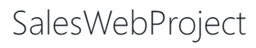
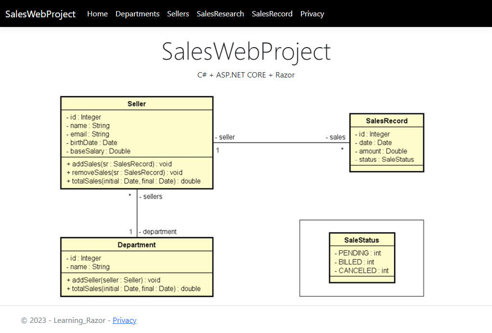

<h1 align="center">
  
</h1>

  <a href="#-tecnologias">Tecnologias</a>&nbsp;&nbsp;&nbsp;|&nbsp;&nbsp;&nbsp;
  <a href="#-projeto">Projeto</a>&nbsp;&nbsp;&nbsp;|&nbsp;&nbsp;&nbsp;
  <a href="#-layout">Layout</a>&nbsp;&nbsp;&nbsp;|&nbsp;&nbsp;&nbsp;
  <a href="#-como-executar">Como executar</a>&nbsp;&nbsp;&nbsp;|&nbsp;&nbsp;&nbsp;
  <a href="#-licença">Licença</a>

  

 

 

  

## ✨ Tecnologias

Esse projeto foi desenvolvido com as seguintes tecnologias:

- [C#](https://dotnet.microsoft.com/en-us/learn/csharp)
- [Razor](https://learn.microsoft.com/en-us/aspnet/core/razor-pages/?view=aspnetcore-7.0&tabs=visual-studio)
- [ASP.NET CORE](https://learn.microsoft.com/en-us/aspnet/core/?view=aspnetcore-7.0)

## 💻 Projeto

O salesWebProject é um app que faz o gerenciamento de atividades economicas entre os departamentos e os vendedores
a partir das vendas ocorridas.

## 🔖 Layout

Você pode visualizar o layout do projeto através da pasta prototipagem do próprio repositório.

## 🚀 Como executar

- Clone o repositório
- Inicie o servidor com `SalesWebSeller.sln`

Agora você pode acessar [`localhost:44369`](https://localhost:44369) do seu navegador.

## 📄 Licença

Esse projeto está sob a licença MIT. Veja o arquivo [LICENSE](LICENSE.md) para mais detalhes.

---

Feito com ♥ by WellingtonPLF 👋🏻 [Contact Me 😊](https://mail.google.com/mail/?view=cm&fs=1&to=wellplf@gmail.com)